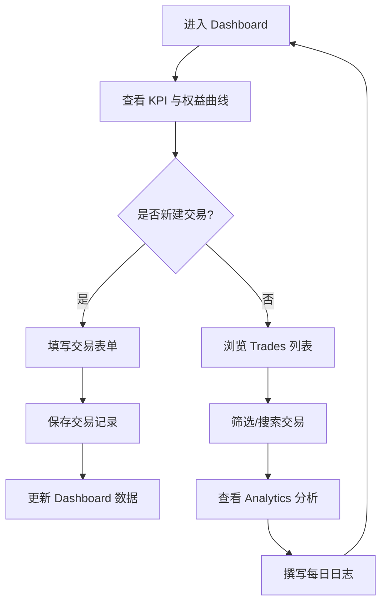

# 交易日志 (Trading Journal) — 产品需求文档

## 1. 产品概述
JOEL Trading Journal 是一款面向个人交易者的交易日志与绩效分析工具，帮助用户记录每笔交易、追踪账户权益变化、分析交易表现并养成复盘习惯。
- 解决问题：交易者缺乏统一的记录与复盘工具，难以量化自己的交易表现与纪律执行情况
- 目标用户：外汇 / 贵金属 / 差价合约等零售交易者，需要精细化管理和复盘交易记录

## 2. 核心功能

### 2.1 用户角色
| 角色 | 注册方式 | 核心权限 |
|------|----------|----------|
| 交易者 | 本地使用，无需注册 | 记录交易、查看分析、管理账户、撰写日志 |

### 2.2 功能模块
1. **Dashboard 仪表盘**：KPI 指标卡片、快捷统计栏、权益曲线图、最近交易列表、每日日志摘要
2. **Trades 交易记录**：交易列表表格、筛选与搜索、交易详情查看
3. **New Trade 新建交易**：交易录入表单（品种、方向、开仓价、平仓价、数量、盈亏、笔记）
4. **Analytics 分析**：盈亏分布图、胜率趋势、品种表现对比、月度绩效热力图
5. **Accounts 账户管理**：多账户切换、账户统计摘要
6. **Settings 设置**：偏好设置、主题切换、数据导出

### 2.3 页面详情
| 页面名称 | 模块名称 | 功能描述 |
|----------|----------|----------|
| Dashboard | KPI 指标卡片 | 展示总权益、今日盈亏、胜率、最大回撤，含环比标签 |
| Dashboard | 快捷统计栏 | 本月交易数、平均持仓、最佳/最差交易 |
| Dashboard | 权益曲线图 | Chart.js 折线图展示权益变化趋势，悬停显示数值 |
| Dashboard | 最近交易 | 展示最新 5 笔交易，含品种、方向、价格、盈亏 |
| Dashboard | 每日日志 | 展示最近 3 条复盘日志，含日期、评级、内容 |
| Trades | 交易表格 | 可排序、可筛选的交易记录表，支持搜索 |
| New Trade | 录入表单 | 完整的交易录入字段，含方向选择、盈亏自动计算 |
| Analytics | 分析图表 | 盈亏分布柱状图、胜率趋势线、品种表现雷达图 |
| Accounts | 账户卡片 | 多账户列表，展示各账户权益与盈亏 |
| Settings | 设置面板 | 主题切换、默认账户、数据管理 |

## 3. 核心流程
用户登录后进入 Dashboard 概览整体表现 → 点击"新建交易"录入交易 → 在 Trades 页面查看和管理所有交易 → 在 Analytics 页面深入分析绩效 → 每日撰写复盘日志

## 4. 用户界面设计

### 4.1 设计风格
- 主色调：白色背景 + 绿色强调色 (#099268)，红色用于亏损 (#e03131)
- 按钮风格：扁平化、小圆角 (6px)、细边框
- 字体：Inter (展示/正文) + JetBrains Mono / SF Mono (数字)
- 布局风格：左侧固定导航栏 + 右侧内容区，卡片式布局
- 图标风格：线性图标 (Lucide)，1.8px 描边
- 整体调性：极简、数据密集、专业克制

### 4.2 页面设计概览
| 页面名称 | 模块名称 | UI 元素 |
|----------|----------|----------|
| Dashboard | KPI 卡片 | 白色卡片、绿色/红色盈亏标签、等宽数字 |
| Dashboard | 权益曲线 | 渐变填充折线图、深色 tooltip |
| Dashboard | 最近交易 | 紧凑行布局、方向标签 (Long/Short) |
| Trades | 交易表格 | 表头排序、行悬停高亮、状态徽章 |
| New Trade | 表单 | 分组输入、方向切换按钮、实时盈亏预览 |
| Analytics | 图表组 | 柱状图 + 折线图 + 雷达图组合 |
| Accounts | 账户卡片 | 选中态高亮、权益展示 |
| Settings | 设置项 | 开关切换、下拉选择 |

### 4.3 响应式设计
- 桌面端优先 (≥1280px)：完整侧边栏 + 多列网格
- 平板端 (768px-1279px)：可折叠侧边栏 + 自适应列数
- 移动端 (<768px)：抽屉式导航 + 单列堆叠 + 触摸优化
