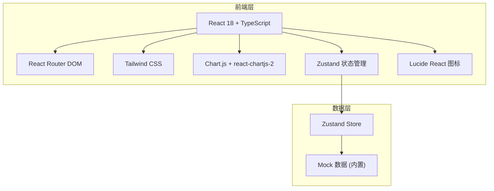

# 交易日志 (Trading Journal) — 技术架构文档

## 1. 架构设计



## 2. 技术说明
- 前端：React@18 + TypeScript + Tailwind CSS@3 + Vite
- 初始化工具：vite-init (react-ts 模板)
- 路由：react-router-dom@6
- 状态管理：zustand
- 图表库：chart.js + react-chartjs-2
- 图标库：lucide-react
- 后端：无（纯前端项目，使用内置 Mock 数据）
- 数据存储：内存 (Zustand Store)，可扩展为 localStorage 持久化

## 3. 路由定义
| 路由 | 页面 | 用途 |
|------|------|------|
| `/` | Dashboard | 仪表盘主页，展示 KPI、权益曲线、最近交易 |
| `/trades` | Trades | 交易记录列表，支持筛选搜索 |
| `/new-trade` | NewTrade | 新建交易表单 |
| `/analytics` | Analytics | 数据分析图表 |
| `/accounts` | Accounts | 账户管理 |
| `/settings` | Settings | 偏好设置 |

## 4. 目录结构
```
src/
├── components/          # 通用组件
│   ├── Layout.tsx       # 页面布局骨架（侧边栏+顶栏）
│   ├── Sidebar.tsx      # 左侧导航栏
│   ├── TopBar.tsx       # 顶部栏
│   ├── KpiCard.tsx      # KPI 指标卡片
│   ├── TradeRow.tsx     # 交易行
│   └── Badge.tsx        # 徽章/标签
├── pages/               # 页面组件
│   ├── Dashboard.tsx
│   ├── Trades.tsx
│   ├── NewTrade.tsx
│   ├── Analytics.tsx
│   ├── Accounts.tsx
│   └── Settings.tsx
├── store/               # Zustand 状态管理
│   └── useTradeStore.ts
├── data/                # Mock 数据
│   └── mockData.ts
├── types/               # TypeScript 类型定义
│   └── index.ts
├── utils/               # 工具函数
│   └── format.ts
├── App.tsx              # 根组件 + 路由
├── main.tsx             # 入口
└── index.css            # 全局样式 + CSS 变量
```

## 5. 数据模型

### 5.1 核心类型定义
```typescript
// 交易记录
interface Trade {
  id: string;
  symbol: string;        // 品种: EUR/USD
  direction: 'long' | 'short';
  entryPrice: number;
  exitPrice: number;
  quantity: number;
  pnl: number;           // 盈亏金额
  pnlPercent: number;    // 盈亏百分比
  openDate: string;
  closeDate: string;
  status: 'open' | 'closed';
  notes?: string;
  account: string;       // 所属账户
}

// 账户
interface Account {
  id: string;
  name: string;
  broker: string;
  balance: number;
  equity: number;
  currency: string;
}

// 日志
interface JournalEntry {
  id: string;
  date: string;
  rating: 'A' | 'B' | 'C';
  content: string;
}

// KPI 指标
interface KpiMetrics {
  totalEquity: number;
  todayPnl: number;
  todayPnlPercent: number;
  winRate: number;
  winCount: number;
  totalCount: number;
  maxDrawdown: number;
  maxDrawdownAmount: number;
}
```

## 6. 设计令牌 (Design Tokens)
沿用设计稿的 CSS 变量系统：
- 颜色：白色背景 (#ffffff) + 绿色强调 (#099268) + 红色亏损 (#e03131)
- 字体：Inter (展示/正文) + SF Mono / JetBrains Mono (数字)
- 间距：4px 基准网格
- 圆角：2px / 6px / 8px
- 阴影：静态阴影 (0 1px 0 0 rgba(0,0,0,0.04)) + 浮动阴影 (0 8px 24px rgba(0,0,0,0.12))
